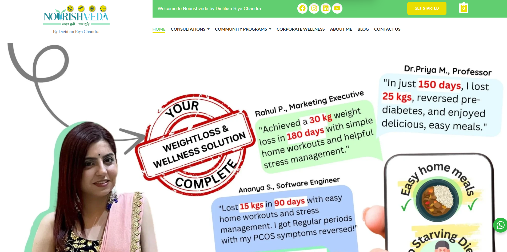

# Nourishveda

### Client
**Dietitian Riyaa Chandra**
### Industry
**Health and Wellness** (Weight Loss and Diet Planning)

[Visit Us](https://nourishveda.fit)

### 🧑🏻‍💻 Technologies Implemented

- PHP
    
- MySQL
    
- WordPress
    
- WooCommerce
    
- Elementor
    
- Astra Theme
    
- Payment Gateway Integration

---
### 🏢  Overview

**Nourishveda** is a health and wellness platform developed for Dietitian Riyaa Chandra, aimed at providing users with personalized, easy-to-follow diet plans to support their weight loss journey. Beyond diet planning, Nourishveda also offers:

- Customized workout routines
    
- Stress management strategies
    
- Tailored wellness consultations

The project’s objective was to design a visually appealing and user-friendly website that allows seamless browsing, booking, and purchasing of services.

---
### 🚧 Challenges

-  **Design Complexity**
	With a wide array of services (diet plans, exercise programs, stress management, etc.), the website design had to be intuitive and user-friendly to simplify navigation.
	
- **E-Commerce Integration**
	The website required a secure and easy-to-use payment gateway, allowing customers to purchase diet and wellness plans effortlessly.
	
-  **User Experience**
	The site had to provide a smooth, trust-building experience, critical in the wellness industry where clients seek expert guidance and reassurance.
	
- **Customization**
	The platform needed to support frequent updates to services, diet plans, and packages—without the need for developer involvement.

---
### 💡Approach & Solution

1. Custom WordPress Theme Development
	Using **WordPress** as the CMS, we built the site with the **Astra theme** for performance and flexibility, and **Elementor** for visual page building.
	- Clean, minimalist design
	- Vibrant, health-inspired color palette
	- Focus on usability and clarity
	
2. Integrated E-Commerce Platform
	We implemented **WooCommerce** to enable the secure purchase of diet plans and packages. Key features included:
	- Simple, guided checkout process
	- Secure payment gateway integration
	- Instant access to purchased content
	
3. Seamless User Experience
	The user journey was designed around clarity and ease of access:
	- Filterable categories (e.g., weight loss, detox, vegetarian)
	- Step-by-step selection guide for personalized diet planning
	- Quick access to services through intuitive layout
	
4. Responsive Design & Mobile Optimization
	Given the high percentage of mobile users, the site was built to be:
	- Fully responsive across all screen sizes
	- Optimized for fast loading and smooth performance
	- Mobile-friendly for on-the-go browsing and purchases

---
### 📈Outcomes

The final Nourishveda website successfully delivered a smooth, engaging user experience and achieved key project goals.

✅ **Enhanced User Engagement**
Minimalist design and smart navigation led to increased user interaction and time spent exploring the platform.

💰 **Increased Sales**
WooCommerce and seamless payment integration led to a measurable increase in purchases of diet and wellness plans.

🤝 **Customer Trust & Retention**
A professional layout, transparent service details, and client testimonials fostered trust, resulting in higher customer retention and repeat business.

📈 **Scalability**
The platform was built to scale easily, allowing Riyaa Chandra to:
- Add new diet plans
- Update existing services
- Respond to evolving client needs without major technical changes
